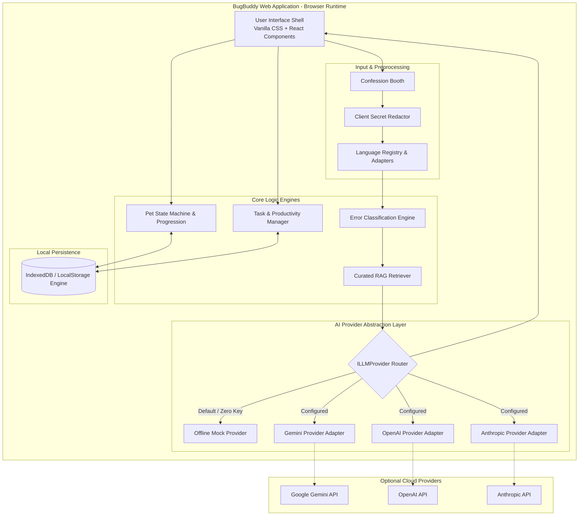

# BugBuddy 🐛⚡

> **"Your bugs are fixable. Your pet's disappointment is optional."**

[](https://github.com/Subhadip-Paul2006/BugBuddy)
[](https://github.com/tt-a1i/archify)
[](https://www.typescriptlang.org/)
[](https://react.dev/)
[](https://www.w3.org/WAI/WCAG21/quickref/)
[](LICENSE)

BugBuddy is a gamified, AI-powered debugging companion and developer productivity web application. It transforms the soul-crushing experience of chasing cryptic compiler panics, syntax blunders, and runtime exceptions into an entertaining, highly educational, and emotionally accountable workflow.

---

## 📌 Table of Contents

- [The Problem & The Solution](#-the-problem--the-solution)
- [Core Features](#-core-features)
- [First-Class Supported Languages](#-first-class-supported-languages)
- [System Architecture & Archify Integration](#-system-architecture--archify-integration)
- [Technology Stack](#-technology-stack)
- [MVP Capabilities vs. Explicit Non-Goals](#-mvp-capabilities-vs-explicit-non-goals)
- [Authoritative Documentation Index](#-authoritative-documentation-index)
- [Repository Structure](#-repository-structure)
- [Quickstart & Development Setup](#-quickstart--development-setup)
- [Environment Configuration](#-environment-configuration)
- [Testing & Quality Assurance](#-testing--quality-assurance)
- [Contributing Guidelines](#-contributing-guidelines)
- [Current Project Status & Roadmap](#-current-project-status--roadmap)

---

## 💡 The Problem & The Solution

### The Problem
Debugging modern code is frustrating, lonely, and cognitively exhausting:
1. **Silent Isolation**: Developers spend up to 50% of their working hours staring at cryptic compiler outputs or stack traces in total isolation.
2. **The Procrastination Trap**: Confronted with intimidating or ambiguous bugs, developers instinctively flee to social media or video streams under the guise of "taking a quick break," leaving tasks unfinished.
3. **Sycophantic, Bloated AI**: Generic commercial AI assistants offer corporate pleasantries (*"I'd love to help with this great question!"*), bury the root cause under paragraphs of conversational fluff, and fail to call out bad programming habits.
4. **Zero Emotional Reward**: Standard issue trackers and IDEs are utilitarian databases providing zero dopamine for fixing hard bugs.

### The Solution
BugBuddy blends tough love with pragmatic software engineering through two tightly synchronized subsystems:
1. **The Bug Confession Booth**: Developers submit code snippets, compiler tantrums, or bug descriptions across six major programming languages. They receive an ego-bruising, hilarious roast targeting code flaws, followed immediately by structured root-cause diagnosis, minimal diffs, and reproducible verification tests.
2. **The Procrastination Pet**: Users adopt an animated virtual coding companion whose emotional well-being reflects their real-world productivity. Completing tasks and resolving bugs awards XP, levels up the pet, and triggers celebrations. Procrastinating, snoozing timers, or abandoning commitments plunges the pet into theatrical, expressive despair.

---

## ✨ Core Features

- **Harsh & Hilarious Roasts**: Direct, sharp, developer-focused satire targeting code smells, obsolete patterns, and careless blunders without personal malice.
- **Actionable Diagnostic Breakdown**: Every roast is paired with root-cause identification, step-by-step fix instructions, clean code diffs, and test suggestions.
- **6 First-Class Languages**: Extensible registry supporting C, C++, Java, Python, JavaScript, and TypeScript with dedicated heuristic parsers.
- **Deterministic Pet Lifecycle**: 5 expressive moods (`ECSTATIC`, `HAPPY`, `NEUTRAL`, `DISAPPOINTED`, `DRAMATIC_DESPAIR`) governed by transparent, user-driven rules.
- **Interactive Multi-Turn Debugging**: Deep-dive into submissions with one-click follow-up actions: *Simpler Explanation*, *Deeper Technical Breakdown*, *Minimal Fix*, *Worked Example*, *More Tests*, *Explain Specific Line*, or *Roast Me Again*.
- **Grounded Knowledge (RAG)**: Integrates language documentation and common pitfall indices with strict source attribution, prompt injection filtering, and offline fallbacks.
- **Zero-Key Offline Capability**: Fully functional out of the box with built-in heuristic analysis and rich mock responses when no AI API key is configured.
- **Client-Side Secret Redaction**: Sensitive credentials (API keys, JWTs, passwords) are automatically stripped before processing.
- **Local Data Persistence**: Browser storage (`IndexedDB` with `localStorage` fallback) preserves pet state, tasks, streaks, and confession history with JSON export/import.

---

## 💻 First-Class Supported Languages

BugBuddy ships with dedicated language adapters for six core programming languages. All six are treated as first-class citizens:

| Language | Primary Detection Heuristics | Common Error Classes Handled | Text Analysis vs Sandbox Scope |
| :--- | :--- | :--- | :--- |
| **C** | `#include <stdio.h>`, pointers `*`, `malloc`, `printf`, `gcc`/`clang` outputs | Segfaults, memory leaks, dangling pointers, buffer overflows, format string mismatches | Text-based static heuristic & LLM diagnosis (No remote compiler sandbox in MVP) |
| **C++** | `#include <iostream>`, `std::`, `template<`, `cout`, `g++`/`clang++` templates | Template instantiation cascades, iterator invalidation, lifetime/RAII violations | Text-based static heuristic & LLM diagnosis (No remote compiler sandbox in MVP) |
| **Java** | `public class`, `System.out.println`, `javac`, stack traces | `NullPointerException`, `ClassNotFoundException`, type mismatch, JVM exceptions | Text-based static heuristic & LLM diagnosis (No remote compiler sandbox in MVP) |
| **Python** | `def `, `import `, indentation, `traceback`, `self`, `kwargs` | `IndentationError`, `TypeError`, `NameError`, `KeyError`, list index out of bounds | Text-based static heuristic & LLM diagnosis (No remote compiler sandbox in MVP) |
| **JavaScript** | `const `, `let `, `function()`, `console.log`, `node`/V8 errors | `TypeError: undefined is not a function`, unhandled promise rejections, closure scope bugs | Text-based static heuristic & LLM diagnosis (No remote compiler sandbox in MVP) |
| **TypeScript** | `interface `, `type `, `as `, `tsconfig.json`, `tsc` outputs | TS2322 (type assignability), TS2339 (property missing), generics mismatch, strict null checks | Text-based static heuristic & LLM diagnosis (No remote compiler sandbox in MVP) |

> **Architectural Boundary**: In the MVP release, all language assistance is static and textual. BugBuddy does not execute untrusted user code inside a remote server sandbox.

---

## 🏛️ System Architecture & Archify Integration

BugBuddy's system architecture, specification taxonomy, and diagram standards are modeled directly on the design principles of [tt-a1i/archify](https://github.com/tt-a1i/archify) (version 3.0.x):



### Architectural Tenets Inspired by Archify:
1. **Bounded Subsystems**: Systems are partitioned into loosely coupled modules (UI Shell, Language Registry, Debug Engine, Pet State Machine, Storage, Provider Abstraction).
2. **Contract-First Interfaces**: Rigid TypeScript interfaces and JSON Schemas define all data interchange boundaries.
3. **Multi-View System Mapping**: Visualized via Archify-compliant models:
   - System Context Architecture ([TRD Section 2](docs/TRD.md#2-system-context-and-component-architecture))
   - Debugging & RAG Sequence Flow ([TRD Section 10](docs/TRD.md#10-retrieval-augmented-generation-rag-architecture))
   - Pet Emotional State Machine ([TRD Section 13](docs/TRD.md#13-pet-state-machine-moods-xp-levels-quests-and-progression-rules))
4. **Verifiable Traceability**: Every architectural component maps directly to PRD requirement IDs (`FR-xxx`, `NFR-xxx`) via the [Requirements Traceability Matrix](docs/TRD.md#23-requirements-traceability-matrix).

---

## 🛠️ Technology Stack

| Layer | Proposed Architecture (MVP) | Implementation Status | Future Production Architecture |
| :--- | :--- | :--- | :--- |
| **Frontend Framework** | React 18+ with TypeScript & Vite | Proposed (Phase 1) | Next.js / Remix SSR |
| **Styling & Design System** | Vanilla CSS (Custom Design Tokens, Glassmorphism, Dark Mode) | Proposed (Phase 1) | Vanilla CSS Modules / Tailwind (if requested) |
| **Client State Management** | Zustand / Lightweight React Context | Proposed (Phase 1) | Zustand with persistent middleware |
| **Local Persistence** | `IndexedDB` with `localStorage` fallback | Proposed (Phase 1) | SQLite / PGlite / Cloud Sync |
| **AI Provider Abstraction** | Unified Adapter: Google Gemini, OpenAI, Anthropic, Mock Fallback | Proposed (Phase 2 & 3) | Edge server proxy with token bucket rate limiting |
| **Knowledge Base (RAG)** | In-memory curated vector/keyword index with Cosine Similarity | Proposed (Phase 3) | ChromaDB / Pgvector serverless store |
| **Testing Suite** | Vitest, React Testing Library, Playwright | Proposed (Phase 4) | Full CI/CD with Vitest & Playwright matrix |

---

## 🎯 MVP Capabilities vs. Explicit Non-Goals

### In Scope for MVP
- ✅ Interactive single-page web application with responsive dark-mode styling.
- ✅ Confession Booth accepting code snippets, bug descriptions, and compiler outputs.
- ✅ First-class adapter support for C, C++, Java, Python, JavaScript, and TypeScript.
- ✅ Sarcastic roast generator followed by actionable diagnosis, fix steps, and tests.
- ✅ Deterministic Procrastination Pet state machine with 5 moods, XP, levels, and quests.
- ✅ Interactive multi-turn chat follow-ups (Simpler, Deeper, Minimal Fix, Tests, etc.).
- ✅ Zero-key offline mock mode enabling full functionality without third-party API keys.
- ✅ Client-side data persistence for tasks, XP, pet state, and confession history.
- ✅ Client-side sensitive credential stripping before transmission.

### Explicit Non-Goals (Out of Scope for MVP)
- ❌ **No Remote Code Execution Sandbox**: BugBuddy will not compile or execute untrusted C/C++/Java/Python/JS code on remote servers.
- ❌ **No Inferred/Creepy User Surveillance**: No webcam gaze tracking, tab-switch penalties, or keyboard biometric spying. Pet reactions depend strictly on explicit user actions and configured deadlines.
- ❌ **No Complex Cloud Microservices or Mandatory Paid Subscriptions**: The app remains lightweight, fast, and hostable on static edge platforms (e.g., Vercel, Netlify, GitHub Pages).
- ❌ **No Multi-User Social Network or Public Leaderboard**: All progression is private to the local user.

---

## 📚 Authoritative Documentation Index

The complete documentation suite for BugBuddy is structured across the following authoritative documents:

1. **[Product Requirements Document (docs/PRD.md)](docs/PRD.md)**  
   *Defines product vision, user personas, functional requirements (`FR-001` to `FR-016`), non-functional requirements (`NFR-001` to `NFR-008`), MVP scope, user stories, and success metrics.*

2. **[Technical Requirements Document (docs/TRD.md)](docs/TRD.md)**  
   *Comprehensive engineering specification: component architectures, language registry, error classifications, response schemas, RAG pipelines, pet state machine equations, security protocols, ADRs, and the Requirements Traceability Matrix.*

3. **[AI Coding Agent Instructions (AI_INSTRUCTIONS.md)](AI_INSTRUCTIONS.md)**  
   *Strict operational guidelines for Cursor and autonomous coding agents: persona rules, forbidden pleasantries, sarcastic tone contracts, architecture boundaries, and quality gates.*

4. **[Implementation Phases Roadmap (docs/PHASES.md)](docs/PHASES.md)**  
   *Sequential five-phase implementation guide (Phase 0 through Phase 4) complete with objectives, deliverables, dependencies, acceptance criteria, and definitions of done.*

---

## 📁 Repository Structure

```text
BugBuddy/
├── README.md                  # Project landing page, overview, and quickstart
├── AI_INSTRUCTIONS.md         # Operational rules and personality constraints for AI agents
├── docs/
│   ├── PRD.md                 # Product Requirements Document (Behavioral & Product Spec)
│   ├── TRD.md                 # Technical Requirements Document (Engineering & Architecture Spec)
│   └── PHASES.md              # Sequential implementation roadmap & milestones
├── src/                       # Application source code (Phase 1+)
│   ├── adapters/              # Language adapters (C, C++, Java, Python, JS, TS)
│   ├── components/            # UI components (Pet, ConfessionBooth, Chat, TaskBoard)
│   ├── engine/                # Debugging pipeline, error classifier, RAG retrieval
│   ├── providers/             # LLM provider abstraction (Gemini, OpenAI, Anthropic, Mock)
│   ├── state/                 # Pet state machine, task store, conversation store
│   └── styles/                # Vanilla CSS tokens, glassmorphic themes, animations
└── tests/                     # Test suites (Unit, component, and E2E)
```

---

## 🚀 Quickstart & Development Setup

*(Placeholder — Active starting in Phase 1)*

### Prerequisites
- Node.js `v18.0.0` or higher (verified with Node `v22.x`)
- npm `v9.x` or higher

### Installation Steps
```bash
# Clone the repository
git clone https://github.com/Subhadip-Paul2006/BugBuddy.git
cd BugBuddy

# Install dependencies (Phase 1+)
npm install

# Start local development server
npm run dev
```

---

## 🔑 Environment Configuration

BugBuddy functions completely without any third-party API credentials using its built-in offline mock engine. To enable live AI provider inference, configure a `.env.local` file:

```bash
# --- AI Provider Configuration ---
# Options: 'mock' (default), 'gemini', 'openai', 'anthropic'
VITE_AI_PROVIDER=mock

# --- API Keys (Leave blank to use offline mock) ---
VITE_GEMINI_API_KEY=
VITE_OPENAI_API_KEY=
VITE_ANTHROPIC_API_KEY=

# --- Application Configuration ---
VITE_APP_TITLE=BugBuddy
VITE_LOG_LEVEL=info
```

> **Security Notice**: Never commit `.env` or `.env.local` files containing live API credentials to version control. All keys are processed strictly client-side or through a user-configured proxy.

---

## 🧪 Testing & Quality Assurance

*(Placeholder — Active starting in Phase 2)*

```bash
# Run unit and contract tests
npm run test

# Run component test suites
npm run test:ui

# Run end-to-end user journey tests
npm run test:e2e
```

---

## 🤝 Contributing Guidelines

Contributions are welcome! Please ensure that:
1. All changes align strictly with [PRD.md](docs/PRD.md) and [TRD.md](docs/TRD.md).
2. Autonomous coding agents adhere faithfully to [AI_INSTRUCTIONS.md](AI_INSTRUCTIONS.md).
3. The sarcastic personality guidelines are maintained without violating harassment or protected trait safety boundaries.

---

## 🚦 Current Project Status & Roadmap

- **Current Milestone**: **Phase 0 — Documentation & Architecture Baseline**
- **Status**: Completed. All specifications, contracts, language registries, and phase gates are fully documented and validated.
- **Next Milestone**: **Phase 1 — UI Foundation & Virtual Pet** (Application shell, pet visualizer, task manager, and local persistence).
