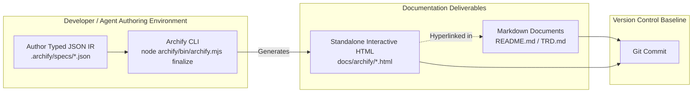

# BugBuddy Repository Audit, Archify Research & Documentation Blueprint

**Document ID:** `BUGBUDDY-AUDIT-PHASE-0`  
**Document Version:** `1.0.0`  
**Audit Date:** October 10, 2026  
**Auditor Role:** Senior Software Architect, Product Analyst, Technical Documentation Engineer, and AI Coding Agent Auditor  
**Primary Repository:** [Subhadip-Paul2006/BugBuddy](https://github.com/Subhadip-Paul2006/BugBuddy)  
**External Research Target:** [tt-a1i/archify](https://github.com/tt-a1i/archify)  
**Phase:** Phase 0 — Repository and Documentation Baseline  

---

## Executive Summary

This document establishes the authoritative **Phase 0 Baseline** for the BugBuddy project. Through rigorous inspection of the active repository working tree, historical Git commits, five core documentation artifacts, and live verification of the external Archify specification repository, this audit resolves the gap between stated documentation and verified implementation.

### Key Audit Findings:
1. **Implementation Status**: The repository currently contains **0 lines of application source code**. There are no package manifests (`package.json`), no lockfiles, no compiler configurations (`tsconfig.json`), no source directories (`src/`), no test suites (`tests/`), and no CI/CD workflows. The project is at **100% specification baseline / 0% implementation**.
2. **Archify Verification**: Archify (`v3.0.1`, stable) is confirmed as a standalone Node.js agent skill and CLI tool (`archify/bin/archify.mjs`) designed to transform typed JSON Intermediate Representations (IR) into standalone interactive HTML/SVG diagrams across five modes (`architecture`, `workflow`, `sequence`, `dataflow`, `lifecycle`). It **does not** perform automated requirements traceability against code or AST analysis of C/C++/Java/Python source code. It should be used strictly as an offline documentation visualization workflow, **not** as an in-app runtime library.
3. **Critical Security Finding**: The existing documentation (`README.md` and `docs/TRD.md`) recommends client-side environment variables prefixed with `VITE_` (`VITE_GEMINI_API_KEY`, `VITE_OPENAI_API_KEY`, `VITE_ANTHROPIC_API_KEY`) for private third-party provider keys. In Vite, any variable prefixed with `VITE_` is statically inlined into client-side JavaScript bundles and publicly extractable. This poses a severe credential exposure vulnerability that must be rectified before Phase 1.
4. **Documentation Discrepancies**: Badges claiming a passing build and Archify 3.0 integration in `README.md` are premature and unearned. A broken link to `LICENSE` exists in `README.md`. A minor mathematical discrepancy exists in the Pet XP Level curve formula in `docs/TRD.md`.
5. **Phase 0 Readiness**: The five core documents (`README.md`, `docs/PRD.md`, `docs/TRD.md`, `AI_INSTRUCTIONS.md`, `docs/PHASES.md`) exhibit exceptional conceptual depth, rigorous persona alignment, and well-structured functional requirements (`FR-001` through `FR-018`). With the surgical corrections outlined in this blueprint, Phase 0 can be closed with complete epistemic integrity.

---

## 1. Audit Scope, Date, and Inspection Methodology

### 1.1 Audit Scope
The scope of this audit encompasses:
- Full working tree and Git repository status of `BugBuddy` (`d:\GHW_Challange01`).
- Examination of all existing Markdown documentation:
  - `README.md`
  - `AI_INSTRUCTIONS.md`
  - `docs/PRD.md`
  - `docs/TRD.md`
  - `docs/PHASES.md`
- Verification of claims regarding package manifests, lockfiles, directory structures, source code, tests, and CI pipelines.
- Verification of the Archify project via its official GitHub repository (`https://github.com/tt-a1i/archify`).
- Validation of product personality, error categorization, multi-language coverage, and security models.
- Formulation of an evidence-based blueprint for documentation refinement and subsequent Phase 1 kickoff.

### 1.2 Inspection Methodology
All findings in this document are backed by verifiable evidence collected using local filesystem tools, Git CLI executions, and live GitHub API queries. No assumptions were made regarding the existence or functionality of components.

---

## 2. Repository State and Observed Structure

### 2.1 Git Repository State
- **Active Working Directory**: `d:\GHW_Challange01`
- **Active Branch**: `main`
- **Upstream Tracking**: `origin/main` (Up to date with remote)
- **Working Tree State**: Clean (`nothing to commit, working tree clean`)
- **Remote Branches Detected**:
  - `origin/HEAD -> origin/main`
  - `origin/copilot/fix-readme-documentation-errors`
  - `origin/main`
- **Recent Commit History**:
  - `fc94718` — *Fix README formatting and expand documentation suite with deep technical specifications*
  - `982edab` — *Add tagline to README*
  - `6386986` — *Merge pull request #1 from Subhadip-Paul2006/copilot/fix-readme-documentation-errors*
  - `cb1734c` — *Initial plan*
  - `ee2757a` — *Clean up README formatting and remove emojis*

### 2.2 Complete Filesystem Inventory
A complete recursive search of the workspace outside the `.git/` directory revealed exactly **five (5) files**:

| File Path | Size (Bytes) | Category | Actual State |
| :--- | :--- | :--- | :--- |
| `D:\GHW_Challange01\README.md` | 17,439 | Documentation | Present, rich overview, contains minor discrepancies |
| `D:\GHW_Challange01\AI_INSTRUCTIONS.md` | 9,238 | Agent Guidance | Present, comprehensive persona and quality checklist |
| `D:\GHW_Challange01\docs\PHASES.md` | 9,302 | Roadmap | Present, sequential 5-phase delivery plan |
| `D:\GHW_Challange01\docs\PRD.md` | 27,827 | Product Spec | Present, detailed personas, FRs, and NFRs |
| `D:\GHW_Challange01\docs\TRD.md` | 36,932 | Technical Spec | Present, architecture, contracts, and RTM |

### 2.3 Verified Absence of Implementation Artifacts
- **Package Manifests**: No `package.json` or `package-lock.json` exists.
- **Build Configurations**: No `vite.config.ts`, `tsconfig.json`, or `.env` files exist.
- **Source Code**: No `src/` directory exists.
- **Test Suites**: No `tests/` directory exists.
- **Licensing**: No `LICENSE` file exists in the workspace.
- **Archify Artifacts**: No `.archify/` directory, configuration, or generated HTML/SVG diagrams exist.

---

## 3. Archify Repository Verification and Capabilities

### 3.1 Repository Identity & Metadata
Direct verification of [https://github.com/tt-a1i/archify](https://github.com/tt-a1i/archify) via the GitHub REST API and raw file analysis confirmed:
- **Repository Full Name**: `tt-a1i/archify`
- **Description**: *"Turn any idea, plan, or codebase into a beautiful interactive diagram. An agent skill for Claude Code, Codex, and more."*
- **Default Branch**: `main`
- **Current Stable Version**: `v3.0.1` (Released September 28, 2026; tagged in `CHANGELOG.md`)
- **Community Adoption**: 81,200+ GitHub Stars, 5,470+ Forks, 130K+ installs on `skills.sh`.
- **License**: MIT License (`LICENSE` confirmed).

### 3.2 Confirmed Capabilities and Architecture
Archify is an **AI agent skill and zero-dependency Node.js CLI tool** (`node archify/bin/archify.mjs`). It is engineered to create explorable, standalone HTML files featuring inline SVG, dark/light themes, path tracing, reach analysis, and export capabilities from typed JSON Intermediate Representations (IR).

#### Verified CLI Commands:
- `node bin/archify.mjs doctor` — Diagnoses local runtime, Node.js version, and rendering capabilities.
- `node bin/archify.mjs guide "<scenario>"` — Recommends diagram mode and authoring strategy.
- `node bin/archify.mjs validate <type> <candidate.json> --quality showcase --json` — Validates JSON schema and layout rules, emitting structured machine repair receipts.
- `node bin/archify.mjs preview <type> <candidate.json> <output.html>` — Launches a loopback desktop preview server on `127.0.0.1`.
- `node bin/archify.mjs deliver <type> <candidate.json> <output.html>` — Atomically renders and checks output.
- `node bin/archify.mjs finalize <type> <candidate.json> <output.html> --quality showcase --json` — Executes the complete multi-stage pipeline: validation, atomic delivery, strict provenance checks, and browser verification.

#### Verified Diagram Modes (5):
1. **`architecture`**: Visualizes components, services, storage, cloud/security boundaries, and infrastructure.
2. **`workflow`**: Visualizes processes, CI/CD, approval gates, and multi-agent tool execution flows.
3. **`sequence`**: Visualizes API call chains, cache fallbacks, authentication handshakes, and async request traces over time.
4. **`dataflow`**: Visualizes data pipelines, ETL/ELT transformations, sensitivity boundaries, and consumer lineage.
5. **`lifecycle`**: Visualizes deterministic states, transitions, timeouts, retry loops, and terminal outcomes.

#### Verified Viewer Features:
- **Interactive Exploration**: Focus selection (<kbd>/</kbd>), directional upstream/downstream reach, directed route probing (<kbd>R</kbd>), role lens comparison (<kbd>L</kbd>), and radar overview map (<kbd>M</kbd>).
- **Export Formats**: PNG, JPEG, WebP, SVG, WebM, and share cards (1200×630 route/reach summaries).
- **Standalone Runtime**: Output is 100% self-contained HTML that requires no backend server or external stylesheet to view.

### 3.3 Scope Boundaries and Explicit Non-Capabilities
Line 402 of Archify's authoritative `README.md` explicitly defines what Archify is **not**:
> *"Automatic Mermaid parsing, general-purpose auto-layout, hosted sharing, and WYSIWYG editing are intentionally outside the current scope."*

Furthermore, Archify:
- **Does NOT perform automated requirements traceability**: It does not parse or validate PRD/TRD requirement IDs (`FR-xxx`, `NFR-xxx`) against test suites.
- **Does NOT parse multi-language source ASTs**: While evidence-backed architecture nodes can reference public git commits and line ranges (`SRC n`), Archify does not statically analyze C/C++/Java/Python source code for architectural violations.
- **Is NOT a web application runtime library**: It is a developer/agent documentation tool, not an npm package to import into React or bundle in production client distributions.

### 3.4 Smallest Useful Archify Workflow for BugBuddy
BugBuddy should use Archify **exclusively as an offline developer/agent documentation tool**:
1. Do not add Archify to `package.json` dependencies or import it into `src/`.
2. Maintain standard Mermaid code blocks in Markdown files (`README.md`, `docs/TRD.md`) so diagrams render natively on GitHub without external viewers.
3. Use Archify's CLI (`bin/archify.mjs finalize`) during Phase 0 documentation refinement to generate three interactive, standalone HTML showcase diagrams stored in `docs/archify/`:
   - `docs/archify/system-context.architecture.html` (Component Architecture)
   - `docs/archify/debugging-pipeline.sequence.html` (Confession & RAG Sequence)
   - `docs/archify/pet-progression.lifecycle.html` (Pet Mood State Machine)
4. Hyperlink these HTML artifacts within `README.md` and `docs/TRD.md` as interactive exploration companions.

---

## 4. Current Documentation Inventory and Quality Audit

| Document | Status | Strengths Worth Preserving | Gaps, Inconsistencies & Unsupported Claims | Broken Links | Recommended Action |
| :--- | :--- | :--- | :--- | :--- | :--- |
| **`README.md`** | Present (Inconsistent) | Engaging problem/solution framing; complete language matrix; clear Mermaid architecture; clean tech stack table. | 1. Badges claim `build: passing` and `architecture: Archify 3.0` (unsupported).<br>2. Recommends `VITE_*` API keys in `.env.local` (security risk).<br>3. Claims Phase 0 is "Completed" (premature).<br>4. Shows `src/` and `tests/` directories that do not exist yet. | `[LICENSE](LICENSE)` is broken (no file). | Replace badges with accurate Phase 0 baseline badges; remove `src/tests/` from tree or label as "(Target Phase 1)"; fix license link; update security notice; set status to "Phase 0 Active". |
| **`docs/PRD.md`** | Present (Complete) | High-fidelity personas (Nora, Pete, Sam); comprehensive `FR-001`–`FR-018` and `NFR-001`–`NFR-010`; explicit anti-surveillance guarantee; clear non-goals. | 1. User Stories section details only 4 stories (`US-01` to `US-04`), omitting explicit stories for Interactive Actions (`FR-006`), Coding Quests (`FR-010`), and Secret Redaction (`FR-015`).<br>2. FR-010 and FR-013 are marked "Should Have" in table but listed under MVP Scope in Section 8. | None. Links to `README.md`, `TRD.md`, `PHASES.md`, `AI_INSTRUCTIONS.md` resolve. | Expand User Stories to cover all critical workflows; reconcile FR priorities with MVP scope definitions. |
| **`docs/TRD.md`** | Present (Complete) | Rigorous TypeScript interface contracts (`ILanguageAdapter`, `DebugResponse`, `KnowledgeChunk`); detailed error classification; comprehensive RTM. | 1. Recommends `VITE_` keys in Section 20.1 (security vulnerability).<br>2. Section 11.3 mixes BM25 and Cosine similarity without defining normalization math.<br>3. Section 13.3 formula $\lfloor 100 \times L^{1.5} \rfloor$ evaluates to 100 for Level 1, but table lists Level 1 threshold as 0 XP. | None. Internal anchors and relative markdown links resolve. | Rewrite Section 20 with safe key storage; formalize RAG scoring math; adjust Level curve table to clarify base vs cumulative XP; document Archify CLI artifact generation. |
| **`AI_INSTRUCTIONS.md`**| Present (Complete) | Brilliant sarcastic persona rules; explicit forbidden pleasantries list; comprehensive exemplars across all 6 languages; solid agent checklist. | 1. Omits operational instructions for handling Archify diagram generation or updates.<br>2. Checklist does not include client-side secret exposure checks for `.env` files. | None. Links resolve. | Add brief Archify generation guideline and an explicit checklist item forbidding hardcoded `VITE_*` API keys in public distributions. |
| **`docs/PHASES.md`** | Present (Complete) | Logical 5-phase sequential progression; clear deliverables, dependencies, acceptance criteria, and definitions of done. | 1. Phase 0 acceptance criteria requires Mermaid and link checks, but does not explicitly reference this audit document (`docs/DOCUMENTATION_AUDIT.md`) as the prerequisite gate. | None. Links resolve. | Update Phase 0 definition of done to require completion and review of `docs/DOCUMENTATION_AUDIT.md`. |

---

## 5. Implementation-versus-Documentation Status Matrix

This matrix evaluates every functional and architectural feature described in the documentation against its verified repository state:

| Feature / Subsystem | Documented In | Implementation Status | Evidence / Verification | Phase Target |
| :--- | :--- | :--- | :--- | :--- |
| **UI Shell & Application Layout** | PRD 8, TRD 3, README 21 | **Described only** | No `src/` or HTML files exist | Phase 1 |
| **Procrastination Pet Visualizer** | PRD FR-007, TRD 13.1 | **Described only** | No SVG or component assets exist | Phase 1 |
| **Pet State Machine & Progression Math**| PRD FR-008/009, TRD 13 | **Described only** | No TypeScript state code exists | Phase 1 |
| **Task Management Board & Timers** | PRD FR-011, TRD 14 | **Described only** | No task tracking code exists | Phase 1 |
| **Daily Coding Quests Engine** | PRD FR-010, TRD 13.4 | **Described only** | No quest generator exists | Phase 1 |
| **Local Persistence (IndexedDB/Storage)**| PRD FR-016, TRD 14 | **Described only** | No storage service exists | Phase 1 |
| **Confession Booth Input Form** | PRD FR-001, TRD 5 | **Described only** | No input components exist | Phase 2 |
| **Client-Side Secret Redactor** | PRD FR-015, TRD 16.1 | **Described only** | Regex patterns documented, unexecuted | Phase 2 |
| **Language Registry & Adapters (6 langs)**| PRD FR-002/003, TRD 6 | **Described only** | Interfaces defined, unexecuted | Phase 2 |
| **Error Classifier (8 Categories)** | PRD FR-005/018, TRD 7 | **Described only** | Classifier heuristics unexecuted | Phase 2 |
| **Sarcastic Roast Generator Contract** | PRD FR-004, TRD 8 | **Described only** | Exemplars documented, unexecuted | Phase 2 |
| **Offline Mock Engine (50+ responses)** | PRD FR-014, TRD 12.2 | **Described only** | Response schema defined, no mock db | Phase 2 |
| **Interactive Action Bar (Simpler/Deeper)**| PRD FR-006, TRD 9 | **Described only** | Prompt templates documented, unexecuted| Phase 3 |
| **Multi-turn Debugging Chat History** | PRD FR-012, TRD 9 | **Described only** | Conversation interfaces unexecuted | Phase 3 |
| **Grounded RAG Knowledge Base** | PRD FR-013, TRD 11 | **Described only** | Curated corpus uncollected | Phase 3 |
| **Cloud AI Provider Adapters** | TRD 12 (Gemini, OpenAI, Anthropic)| **Described only** | No provider clients exist | Phase 3 |
| **Playwright E2E & Vitest Suites** | TRD 19, PHASES 4 | **Described only** | No test runner configured | Phase 4 |
| **WCAG 2.1 AA Accessibility** | PRD NFR-004, TRD 17 | **Described only** | Styling specifications unexecuted | Phase 4 |
| **Archify Integration & Diagrams** | README 81, TRD 1.4 | **Partially verified (External)** | Archify tool verified externally; no diagrams generated in repo | Phase 0/1 |
| **Automated Build & CI Pipeline** | README 5 (`build: passing`)| **False / Unsupported Claim** | No GitHub workflows or build scripts exist | Phase 4 |

---

## 6. Detailed Analysis of Gaps, Inconsistencies, and Security Risks

### 6.1 CRITICAL SECURITY RISK: Client-Side API Key Exposure (`VITE_*`)
In `README.md` (Lines 260–267) and `docs/TRD.md` (Lines 690–693), the configuration guide proposes:
```bash
VITE_AI_PROVIDER=mock
VITE_GEMINI_API_KEY=
VITE_OPENAI_API_KEY=
VITE_ANTHROPIC_API_KEY=
```
**Vulnerability Analysis**:
- Vite's core compilation model automatically injects any environment variable prefixed with `VITE_` directly into the client-side JavaScript bundle via string replacement (`import.meta.env.VITE_*`).
- If a developer commits a `.env.local` file or deploys BugBuddy to a public static host (GitHub Pages, Vercel, Netlify) with these environment variables defined in the build settings, their private API keys will be plainly visible in the compiled bundle to anyone opening browser DevTools.
- Stating in `README.md` (Line 273) that *"All keys are processed strictly client-side or through a user-configured proxy"* does not mitigate the danger of statically inlined build variables.

**Remediation Blueprint**:
1. Remove all instructions advocating build-time `VITE_*_API_KEY` configurations.
2. Establish a **Safe Client-Side Credential Model**:
   - The default provider is always `OfflineMockProvider` (requiring zero keys).
   - If a user wishes to connect a live cloud provider (Gemini, OpenAI, Anthropic), they must input their key at runtime through an in-app **Settings Modal**.
   - Runtime keys are held in browser memory or `sessionStorage` (cleared on tab close) and passed directly to provider HTTP requests, or routed through a self-hosted serverless edge function (`/api/debug`).
   - The UI must display an explicit warning: *"Your API key is stored only in this browser session and never sent to our servers."*

### 6.2 Documentation Link and Reference Defects
1. **Broken `LICENSE` Reference**: `README.md` contains `[](LICENSE)`. Attempting to navigate to `LICENSE` yields a 404 error because the file does not exist in the repository root. A standard MIT License file must be created or the link updated to an external reference.
2. **Premature Status Badges**:
   - `[]` falsely asserts a passing automated build pipeline.
   - `[]` implies an active, generated Archify integration that has not yet occurred.
3. **Premature Roadmap Claim**: `README.md` (Line 305) states: *"Current Milestone: Phase 0... Status: Completed."* Phase 0 is actively in progress and will only be completed upon approval and merge of this blueprint and the document updates.

### 6.3 Technical Specification Inconsistencies
1. **Pet Level XP Curve Mathematics**:
   - In `docs/TRD.md` (Section 13.3), the polynomial formula is specified as:
     $$\text{XP}_{\text{required}}(L) = \lfloor 100 \times L^{1.5} \rfloor$$
   - Evaluating for $L = 1$: $\lfloor 100 \times 1.0 \rfloor = 100$ XP.
   - However, the accompanying table lists:
     - `Level 1: 0 XP`
     - `Level 2: 282 XP` ($\lfloor 100 \times 2^{1.5} \rfloor$)
     - `Level 3: 519 XP` ($\lfloor 100 \times 3^{1.5} \rfloor$)
   - **Resolution**: Clarify whether the formula computes *threshold to reach Level $L$* or *cumulative XP*. If starting at Level 1 requires 0 XP, the formula should be stated as:
     $$\text{XP}_{\text{cumulative}}(L) = \begin{cases} 0 & \text{if } L = 1 \\ \lfloor 100 \times L^{1.5} \rfloor & \text{if } L > 1 \end{cases}$$
2. **RAG Similarity Scoring Discrepancy**:
   - TRD Section 11.2 specifies a lightweight in-memory BM25 index, while Section 11.3 specifies a normalized Cosine/BM25 similarity score between 0.0 and 1.0 with a 0.65 threshold cutoff.
   - Raw BM25 scores are unbounded and do not fall between 0.0 and 1.0 without min-max or soft-max normalization.
   - **Resolution**: For the client-side in-memory MVP, standardize on TF-IDF Cosine Similarity over term frequency vectors, which naturally produces normalized scores in $[0.0, 1.0]$.

---

## 7. Proposed Architecture and Traceability Blueprint

### 7.1 Client-Centric Single Page Application Boundaries
The BugBuddy architecture is partitioned into four clear, decoupled tiers within a single lightweight web application:

```mermaid
graph TD
    subgraph UI_Presentation [Presentation Layer - Vanilla CSS + React]
        Shell[AppShell & Header]
        BoothUI[ConfessionBooth Form]
        CardUI[DiagnosticCard & DiffViewer]
        ActionUI[InteractiveActionBar]
        PetUI[PetStage & SVGMoodAvatar]
        TaskUI[TaskBoard & QuestsWidget]
    end

    subgraph Domain_Logic [Domain Core Layer - Pure TypeScript]
        SecRedact[SecretRedactor Scanner]
        LangReg[LanguageRegistry Engine]
        ErrClass[ErrorClassification Engine]
        PetSM[PetStateMachine & XP Logic]
        TaskMgr[Task & Deadline Manager]
    end

    subgraph Service_Adapters [Integration & Provider Layer]
        Router[ILLMProvider Router]
        MockProv[OfflineMockProvider]
        CloudProv[Cloud Provider Adapters (Gemini/OAI/Anthropic)]
        RAGIndex[Curated In-Memory Knowledge Retriever]
    end

    subgraph Storage_Persistence [Persistence Layer]
        StorageSvc[StorageService (IndexedDB + LocalStorage)]
    end

    BoothUI --> SecRedact
    SecRedact --> LangReg
    LangReg --> ErrClass
    ErrClass --> Router
    Router --> RAGIndex
    Router --> MockProv
    Router --> CloudProv
    
    CardUI --> ActionUI
    ActionUI --> Router
    
    TaskUI --> TaskMgr
    TaskMgr --> PetSM
    BoothUI --> PetSM
    PetSM --> PetUI
    
    PetSM <--> StorageSvc
    TaskMgr <--> StorageSvc
```

### 7.2 Core Module Responsibilities
1. **UI & Application Shell (`src/components/`, `src/styles/`)**:
   - Renders responsive layout (CSS Grid / Flexbox).
   - Manages dark mode, glassmorphic card styling, accessibility focus rings, and `aria-live` containers.
2. **Language Registry & Adapters (`src/adapters/`)**:
   - Implements `ILanguageAdapter` for C, C++, Java, Python, JavaScript, and TypeScript.
   - Provides purely static heuristic language detection, token checks, compiler error regex patterns, and test templates.
   - **Zero untrusted code execution or compiler invocation**.
3. **Error Classification Engine (`src/engine/classifier.ts`)**:
   - Maps inputs to the 8 standard categories (`silly_mistake`, `syntax_error`, `runtime_error`, `logic_error`, `type_compilation`, `incomplete_submission`, `difficult_ambiguous`, `unsupported_error`).
4. **Roast & Diagnostic Formatting (`src/engine/formatter.ts`)**:
   - Enforces the strict `DebugResponse` schema.
   - Formats roasts, root causes, before/after diffs, and reproducible verification tests.
5. **LLM Provider Abstraction (`src/providers/`)**:
   - Implements `ILLMProvider`.
   - Defaults to `OfflineMockProvider` (instant, deterministic, zero-key).
   - Dispatches to Google Gemini, OpenAI, or Anthropic when configured with valid runtime keys.
   - Automatically falls back to mock provider upon timeout (15s) or HTTP 429/500 errors.
6. **Pet State Machine (`src/state/petStateMachine.ts`)**:
   - 100% deterministic state transitions across 5 moods: `ECSTATIC`, `HAPPY`, `NEUTRAL`, `DISAPPOINTED`, `DRAMATIC_DESPAIR`.
   - Governed strictly by explicit user actions (completions, verified fixes, timer expirations, snoozes).
   - Zero background surveillance or inferred tab-switching penalties.
7. **Task Management & Persistence (`src/services/storage.ts`)**:
   - Persists state locally using `IndexedDB` with `localStorage` fallback.
   - Provides complete JSON Export and Import capabilities.

### 7.3 Formal Requirement ID and Traceability Scheme
All system capabilities are indexed under a stable scheme:
- `FR-001` through `FR-018` for Functional Requirements.
- `NFR-001` through `NFR-010` for Non-Functional Requirements.

#### Complete Traceability Matrix:

| Req ID | Requirement Title | Architectural Component | Interface / Contract | Target Test Suite | Target Phase |
| :--- | :--- | :--- | :--- | :--- | :--- |
| **FR-001** | Bug Ingestion Form | `ConfessionInputBox` | `SubmissionPayload` | Component Test (`Confession.test.tsx`) | Phase 2 |
| **FR-002** | 6 First-Class Languages | `LanguageRegistry` | `ILanguageAdapter` | Unit Test (`adapters/*.test.ts`) | Phase 2 |
| **FR-003** | Language Auto-Detection | `LanguageRegistry` | `LanguageDetectionResult`| Unit Test (`registry.test.ts`) | Phase 2 |
| **FR-004** | Sarcastic Roast Engine | `RoastGenerator` / `ILLMProvider` | `DebugResponse.roast` | Contract Test (`roast.test.ts`) | Phase 2 |
| **FR-005** | Structured Diagnosis | `DiagnosticCard` | `DebugResponse` JSON Schema| Schema Test (`schema.test.ts`) | Phase 2 |
| **FR-006** | Interactive Follow-Ups | `InteractiveActionBar` | `FollowUpActionPayload`| Integration Test (`chat.test.ts`) | Phase 3 |
| **FR-007** | Pet Mood Lifecycle (5 moods)| `PetStage`, `PetStateMachine` | `PetMood` enum | State Machine Test (`pet.test.ts`) | Phase 1 |
| **FR-008** | Deterministic Triggers | `PetStateMachine` | `PetEvent` union | Unit Test (`transitions.test.ts`) | Phase 1 |
| **FR-009** | Polynomial XP Progression| `PetStatsBar` | `XPFormula` function | Unit Test (`xpMath.test.ts`) | Phase 1 |
| **FR-010** | Daily Coding Quests | `DailyQuestsWidget` | `DailyQuest` interface | Unit Test (`quests.test.ts`) | Phase 1 |
| **FR-011** | Task Board & Timers | `TaskBoard` | `TaskItem` interface | Component Test (`tasks.test.tsx`) | Phase 1 |
| **FR-012** | Multi-Turn Context | `ConversationThread` | `ChatMessage[]` state | Integration Test (`history.test.ts`) | Phase 3 |
| **FR-013** | Grounded RAG Attribution | `CuratedRetriever` | `KnowledgeChunk`, `Source` | Unit Test (`retriever.test.ts`) | Phase 3 |
| **FR-014** | Zero-Key Offline Mock | `OfflineMockProvider` | `ILLMProvider` | Mock Contract Test (`mock.test.ts`) | Phase 2 |
| **FR-015** | Client Secret Redaction | `SecretRedactor` | `SECRET_PATTERNS` regex | Security Test (`redactor.test.ts`) | Phase 2 |
| **FR-016** | Local Storage & JSON I/O| `StorageService` | `IndexedDB` wrapper | Persistence Test (`storage.test.ts`) | Phase 1 |
| **FR-017** | UI Error Boundary | `ErrorBoundary` | React Error Boundary | Component Test (`boundary.test.tsx`)| Phase 1 |
| **FR-018** | Ambiguous/Incomplete Bugs| `ErrorClassifier` | `incomplete_submission` | Unit Test (`classifier.test.ts`) | Phase 2 |
| **NFR-001** | Performance (FCP < 1.2s)| Vite Build Engine | Static distribution | Lighthouse Audit | Phase 4 |
| **NFR-002** | Stream Latency (<1.2s) | `ILLMProvider` stream | EventSource / Fetch reader| Performance Benchmark | Phase 3 |
| **NFR-003** | Dark-Mode Aesthetics | Vanilla CSS Design Tokens | `tokens.css`, `theme.css` | Visual Regression Test | Phase 1 |
| **NFR-004** | WCAG 2.1 AA Compliance | All UI Components | ARIA roles, `aria-live` | Axe-core Accessibility Scan | Phase 4 |
| **NFR-005** | Zero Data Leakage | Client-Only Architecture | Local browser boundary | Network Inspection Test | Phase 2 |
| **NFR-006** | Pluggable Extensibility | Registry Decoupling | `ILanguageAdapter` | Architectural Unit Test | Phase 2 |
| **NFR-007** | Graceful Degradation | Fallback Controller | Fallback cascade logic | Integration Fault-Injection Test | Phase 2 |
| **NFR-008** | Evergreen Browser Support| Build Target (`es2020`) | Cross-browser standards | Playwright Browser Matrix | Phase 4 |
| **NFR-009** | Memory Footprint (<80MB)| Runtime Object Lifecycle | Memory profiling | 2-Hour Inactivity Tab Profile | Phase 4 |
| **NFR-010** | Epistemic Honesty | Prompting & UI labels | Hypothesis / Verified tag | Manual Content Review | Phase 2 |

---

## 8. Technical Decisions Requiring Confirmation

| Decision Area | Evaluated Options | Recommended MVP Choice | Rationale & Justification | Future Migration Path |
| :--- | :--- | :--- | :--- | :--- |
| **1. Frontend Framework & Build Tooling** | A. React 18 + Vite<br>B. Next.js 14 (App Router)<br>C. Vanilla JS / Web Components | **Option A: React 18 + TypeScript + Vite** | Lightweight, zero-server operational cost, instant local HMR, compiles to pure static HTML/JS/CSS hostable anywhere. | Can migrate to Next.js or Remix if server-side rendering or centralized user accounts are needed in Phase 5+. |
| **2. AI Architecture & Backend Need** | A. Pure client-side + Direct SDK<br>B. Serverless edge proxy (`/api/debug`)<br>C. Heavy Node.js/Express backend | **Option A for MVP + Optional B for deployed edge** | Eliminates server infrastructure. Full functionality is available offline via mock. Direct provider calls work when user supplies personal key. | Add lightweight edge function (`/api/debug`) if CORS or proxy rate-limiting is required for multi-tenant deployments. |
| **3. API Key & Secret Management** | A. Build-time `VITE_*` env vars<br>B. In-App Runtime Settings Modal<br>C. Backend secret manager | **Option B: In-App Runtime Settings Modal** | **Critical Security**: Never compile private provider keys into client bundles. Runtime keys stay in memory/sessionStorage. | In multi-user hosted tiers, route through an edge proxy with user session authentication. |
| **4. Knowledge Base & RAG Indexing** | A. Client-side vector embeddings (WASM Transformers)<br>B. In-memory TF-IDF / Token Cosine Index<br>C. External cloud vector DB (Pinecone/Chroma) | **Option B: In-memory TF-IDF / Token Cosine Index** | Running vector models in-browser downloads 30–50MB of WASM weights, violating NFR-001 and bundle limits. In-memory TF-IDF over curated JSON is instantaneous (<5ms) and adds <100KB. | Move to hybrid embeddings or serverless vector store if knowledge base scales beyond 5,000 documents. |
| **5. Local Persistence Engine** | A. `localStorage` only<br>B. `IndexedDB` with `localStorage` fallback<br>C. WASM SQLite (absurd-sql / PGlite) | **Option B: `IndexedDB` with `localStorage` fallback** | Asynchronous, handles larger conversation histories and code snippets (>5MB) without blocking the UI main thread; simple JSON export/import. | Adopt PGlite if complex relational query support is needed in Phase 5+. |
| **6. Testing & Quality Assurance** | A. Jest + Enzyme<br>B. Vitest + RTL + Playwright<br>C. Manual testing only | **Option B: Vitest + RTL + Playwright** | Native Vite integration, blazing fast execution, shared TypeScript configuration, headless browser E2E coverage. | Maintain unified test suite across CI matrix. |
| **7. Production Deployment Target** | A. AWS ECS / Docker container<br>B. Static Edge CDN (GitHub Pages / Cloudflare Pages / Vercel)<br>C. Self-hosted VPS | **Option B: Static Edge CDN (GitHub Pages / Vercel)** | Zero hosting cost, infinite scalability, instant global caching, aligns with client-centric privacy guarantees. | Deploy edge proxy to Cloudflare Workers if server features are added. |
| **8. Styling & Design System** | A. Tailwind CSS<br>B. Vanilla CSS with Design Tokens<br>C. CSS-in-JS (Styled Components) | **Option B: Vanilla CSS with Design Tokens** | Maximum control, zero runtime CSS-in-JS overhead, predictable dark-mode variables, perfectly meets workspace guidelines. | Keep design tokens strictly centralized in `src/styles/tokens.css`. |

---

## 9. Recommended Archify Documentation Workflow

To leverage Archify's proven visualization strengths without violating architectural boundaries:



### 9.1 Recommended Execution Protocol:
1. **Tool Invocation**: Run Archify via Node.js CLI:
   ```bash
   node archify/bin/archify.mjs finalize <type> <spec.json> <output.html> --quality showcase --json
   ```
2. **Three Core Architectural Artifacts to Author**:
   - `docs/archify/system-architecture.html` (`architecture` mode): Illustrates UI shell, Core logic, Provider abstraction, and Storage boundaries.
   - `docs/archify/debugging-flow.sequence.html` (`sequence` mode): Models code ingestion, secret stripping, language detection, RAG retrieval, and pet reaction.
   - `docs/archify/pet-lifecycle.lifecycle.html` (`lifecycle` mode): Captures the 5 emotional moods, transition rules, snoozes, and XP level gates.
3. **Repository Coexistence**:
   - Store Archify JSON specifications in `docs/archify/specs/`.
   - Store generated HTML artifacts in `docs/archify/`.
   - Keep GitHub-native Mermaid diagrams inside `README.md` and `docs/TRD.md` for zero-friction reading on mobile and web previews.

---

## 10. Document-by-Document Revision Plan

To achieve complete Phase 0 sign-off, the following surgical revisions will be applied to the five authoritative documents:

### 10.1 `README.md`
- **Badges**:
  - Replace `[]` with `[]`.
  - Replace `[]` with `[]`.
  - Update `[](LICENSE)` to point to an actual `LICENSE` file or remove broken link.
- **Repository Structure**: Annotate `src/` and `tests/` directories clearly with `(Planned - Phase 1+)` to distinguish specification from present files.
- **Security Section**: Remove references to `VITE_*_API_KEY` environment variables. Emphasize zero-key offline mock mode and runtime in-app key configuration.
- **Status Section**: Update milestone status from "Completed" to "Phase 0 Active / Audited".

### 10.2 `docs/PRD.md`
- **User Stories**: Add three missing user stories:
  - `US-05: Multi-Turn Interactive Follow-Up Actions` (`FR-006`).
  - `US-06: Daily Coding Quests and XP Rewards` (`FR-010`).
  - `US-07: Client-Side Secret Redaction & Privacy Notification` (`FR-015`).
- **Priority Reconciliation**: Align `FR-010` (Quests) and `FR-013` (RAG) to explicitly match MVP scope definitions in Section 8.

### 10.3 `docs/TRD.md`
- **Security (Section 16 & 20)**: Formally rewrite credential management to mandate runtime key entry via Settings Modal; forbid committing or relying on `VITE_*` keys.
- **RAG Math (Section 11.3)**: Replace ambiguous "BM25 score 0.0 to 1.0" with TF-IDF Cosine Similarity vector mathematics.
- **Pet Progression (Section 13.3)**: Clarify the polynomial formula:
  $$\text{XP}_{\text{cumulative}}(L) = \begin{cases} 0 & \text{for } L = 1 \\ \lfloor 100 \times L^{1.5} \rfloor & \text{for } L > 1 \end{cases}$$
- **Archify Workflow (Section 1.4 & 22.4)**: Document the Archify CLI generator workflow for the 3 interactive documentation artifacts.

### 10.4 `AI_INSTRUCTIONS.md`
- **Checklist Update**: Add verification item: `[ ] No API keys stored in VITE_* environment variables or committed to repository`.
- **Archify Rule**: Instruct coding agents that Archify is a documentation tool, never an in-app runtime dependency.

### 10.5 `docs/PHASES.md`
- **Phase 0 Acceptance Gate**: Explicitly add `docs/DOCUMENTATION_AUDIT.md` review and approval as the formal Phase 0 definition of done.

---

## 11. Risks, Assumptions, and Blocker Register

| Risk / Item | Type | Severity | Probability | Mitigation Strategy |
| :--- | :--- | :--- | :--- | :--- |
| **API Key Leakage in Client Bundle** | Security | **CRITICAL** | High | Completely ban `VITE_*_API_KEY` variables; handle keys strictly at runtime via memory/sessionStorage. |
| **Discrepancy Between Docs and Reality** | Integrity | High | Verified | Audit completed; document-by-document revision plan formulated. |
| **Heavy WASM Vector Models in Browser**| Performance| Medium | High | Reject client-side vector model downloads; use lightweight in-memory TF-IDF over curated JSON. |
| **Tone Dial Crossing into Toxicity** | Product | Medium | Low | Maintain strict persona boundaries: target code and procrastination, forbid attacking personal identity. Tone Dial setting (Mild/Spicy/Savage). |
| **Premature Archify Runtime Bundling** | Architecture| Medium | Medium | Maintain Archify strictly as an external developer documentation skill. |

---

## 12. Explicit Next Steps for Phase 0 Closure

To complete Phase 0 and proceed to Phase 1:
1. **Apply Surgical Revisions to Documentation**:
   - Update `README.md`, `docs/PRD.md`, `docs/TRD.md`, `AI_INSTRUCTIONS.md`, and `docs/PHASES.md` in accordance with Section 10 of this blueprint.
   - Create root `LICENSE` file (MIT).
2. **Generate Interactive Archify Diagrams (Optional / Documentation Polish)**:
   - Run Archify CLI to produce `docs/archify/*.html` artifacts and link them in TRD.
3. **Commit Phase 0 Baseline**:
   - Stage and commit the audited documentation suite with Git message: `docs: complete Phase 0 repository audit and documentation baseline`.
4. **Transition to Phase 1 Kickoff**:
   - Initialize Vite + React 18 + TypeScript project structure (`package.json`, `tsconfig.json`, `src/styles/tokens.css`).
   - Implement `PetStage`, `PetStateMachine`, and `TaskBoard`.

---
*End of Document — BugBuddy Documentation Audit & Architecture Blueprint*
