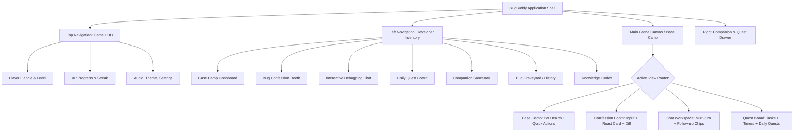

# BugBuddy UI/UX Specification: Minecraft-Inspired Developer Survival World

**Document ID:** `BUGBUDDY-UI-UX-SPEC-V1`  
**Document Version:** `1.0.0`  
**Status:** Approved Specification  
**Design Lead:** Senior UI/UX Designer, Game Interface Architect & Design Systems Engineer  
**Reference Index:** [README.md](../README.md) | [docs/PRD.md](PRD.md) | [docs/TRD.md](TRD.md) | [docs/PHASES.md](PHASES.md) | [AI_INSTRUCTIONS.md](../AI_INSTRUCTIONS.md) | [docs/DOCUMENTATION_AUDIT.md](DOCUMENTATION_AUDIT.md)

---

## 1. Design Vision and Visual Identity

### 1.1 The Metaphor: The Developer's Survival Base
Software engineering is a survival game. Developers venture into treacherous codebases filled with lurking null pointers, volatile race conditions, and memory leaks (hostile mobs). When cornered by a cryptic stack trace, the developer retreats to their **Survival Base**—BugBuddy.

BugBuddy is not another sterile, corporate SaaS dashboard with generic glassmorphism and pastel gradients. It is a **tactile, gamified command post** combining the cozy charm, modular block geometry, and satisfying progression mechanics of a voxel sandbox (inspired by Minecraft's visual grammar) with a high-performance, developer-grade debugging workspace.

```text
┌───────────────────────────────────────────────────────────────────────────────┐
│                       BUGBUDDY CORE VISUAL METAPHOR                           │
├──────────────────────────┬────────────────────────────────────────────────────┤
│ Game Concept             │ Developer Reality Equivalent                       │
├──────────────────────────┼────────────────────────────────────────────────────┤
│ Survival Base / Campfire │ BugBuddy App Shell & Productivity Hub              │
│ Hostile Mobs (Creepers)  │ Bugs, Syntax Errors, Stack Traces, Compiler Panics │
│ Sword & Crafting Table   │ The Bug Confession Booth & Interactive Chat        │
│ XP Orbs & Leveling       │ Resolved Bugs, Completed Tasks, Daily Streaks      │
│ Tamed Pet Companion      │ The Procrastination Pet (Mood reflecting output)   │
│ Redstone Circuitry       │ Error Redaction, Input Processing & Analysis Engine│
│ Enchantment Table        │ The Knowledge Codex (Grounded RAG Documentation)   │
│ Hotbar / Inventory       │ Persistent Tool & Section Navigation Sidebar       │
└──────────────────────────┴────────────────────────────────────────────────────┘
```

### 1.2 Core Design Principles
1. **Blocky Depth & Tactile Physicality**: Surfaces utilize clean, layered voxel-style borders (inset and outset pixel-beveled shadows) giving cards the feel of sculpted stone, obsidian, and wood slabs.
2. **Atmospheric Contrast**: Deepslate backgrounds (`#121417`, `#181A1F`) provide high-contrast backdrops that make Emerald greens, Redstone crimsons, Gold XP accents, and Diamond blues pop with purpose.
3. **Typography Dual-Classing**: Headings and game HUD stats use crisp pixel-style fonts (`Press Start 2P` or `Silkscreen`), while code editors and long diagnostic explanations use hyper-legible developer typefaces (`JetBrains Mono` and `Inter`) to prevent eye fatigue.
4. **Sarcastic Emotional Stake**: The virtual companion is a living entity inside this base. It does not speak in corporate pleasantries. It delivers biting, sharp humor from its pixelated hearth.
5. **Epistemic & Functional Honesty**: Visual styling never sacrifices utility. Code blocks are copy-pasteable in one click, diffs are mathematically clear, and remote execution is never falsely implied.

---

## 2. Target Users and UX Goals

```text
┌────────────────────────────────────────────────────────────────────────┐
│                        User Personas & UX Targets                      │
├────────────────────┬────────────────────┬──────────────────────────────┤
│ Novice Nora        │ Procrastinating    │ Senior Sam                   │
│ (CS Student)       │ Pete (Junior Eng)  │ (Lead Architect)             │
│ "Why did my C code │ "Just one YouTube  │ "Spare me the pleasantries;  │
│ segfault again?"   │ video before fix." │ give me the diff and tests." │
└────────────────────┴────────────────────┴──────────────────────────────┘
```

### 2.1 UX Goals
- **Instant Orientation (< 2 seconds)**: The top HUD and base-camp dashboard immediately communicate: (1) active pet mood, (2) current XP/level, and (3) a one-click CTA to confess a bug.
- **Dopamine-Fueled Feedback**: Completing tasks and fixing bugs awards floating gold XP particles and audible or visual level-up celebrations.
- **Zero-Friction Confession**: Pasting code, detecting language, stripping secrets, and rendering a structured diagnosis completes smoothly with zero required modal popups.
- **Accessible Legibility (WCAG 2.1 AA)**: All text passes 4.5:1 contrast ratios. Screen readers receive live status announcements for pet mood changes and chat responses.

---

## 3. Information Architecture



---

## 4. Navigation Model

### 4.1 Top Navigation: The Game HUD
A compact, fixed-height (56px) game heads-up display anchored to the top of the viewport. It avoids the look of a traditional enterprise navbar and resembles an RPG status bar:

```text
┌──────────────────────────────────────────────────────────────────────────────────────────────────┐
│ [🐛 BUG-BUDDY] │ ⚔️ DEV-PLAYER [LVL 3] │ [████████░░░░░ 519/800 XP] │ 🔥 4-DAY STREAK │ [⚙️ SETTINGS] │
└──────────────────────────────────────────────────────────────────────────────────────────────────┘
```

- **Brand Block (Left)**: Pixelated bug icon paired with bold Minecraft-style block lettering (`BUGBUDDY`).
- **Player Stats (Center-Left)**: Local player handle with pixel badge indicating current title (*"Console.log Archaeologist"*).
- **XP Bar (Center)**: Segmented retro health/XP bar displaying current level progress with animated gold fill.
- **Streak Tracker (Center-Right)**: Flickering pixelated campfire/flame icon showing consecutive days of active debugging.
- **Utility HUD (Right)**: Retro toggle buttons for Audio effects (Chiptune click SFX), High-Contrast Mode, and Settings Modal.

### 4.2 Left Sidebar: The Developer Inventory
A persistent 240px sidebar styled as an open game inventory hotbar with carved stone borders and pixel-art category icons:

```text
┌─────────────────────────┐
│ 🧰 DEVELOPER INVENTORY  │
├─────────────────────────┤
│ [🏕️] Base Camp          │ <- Active (Green Emerald Border)
│ [⚔️] Confession Booth   │
│ [💬] Debugging Chat     │
│ [📜] Quest Board        │
│ [🐾] Companion Stage    │
│ [🪦] Bug Graveyard      │
│ [📖] Knowledge Codex    │
│ [⚙️] Base Settings      │
├─────────────────────────┤
│ [🔻 COLLAPSE SIDEBAR]   │
└─────────────────────────┘
```

- **Collapsible State**: On desktop screens, clicking collapse minimizes the sidebar to a 64px compact icon hotbar. On tablet/mobile, it transforms into an off-canvas drawer triggered by an inventory chest icon button in the HUD.
- **Active State Feedback**: Selected item features an emerald green border (`#2ECC71`), an indented slab background, and an emerald arrow indicator (`►`).

---

## 5. Main Dashboard Layout: Base Camp

The **Base Camp** is the default view. It represents the developer's cozy survival haven between coding battles.

```text
┌────────────────────────────────────────────────────────────────────────────────────────────────────────┐
│ [TOP HUD: PLAYER STATUS & XP]                                                                          │
├───────────────┬────────────────────────────────────────────────────────┬───────────────────────────────┤
│ [INVENTORY]   │ [THE HEARTH: SURVIVAL BASE]                            │ [COMPANION & QUEST STATUS]    │
│               │ ┌────────────────────────────────────────────────────┐ │                               │
│ Base Camp     │ │  🔥 CAMPFIRE & PIXEL PET STAGE                     │ │ 🐾 PET SUMMARY                │
│ Confession    │ │     [  ^ _ ^  ]   Mood: HAPPY                      │ │ Mood: HAPPY (Level 3)         │
│ Debug Chat    │ │     /|  💻  |\   "You survived the morning        │ │ Next: Senior Breakpoint Guru│
│ Quests        │ │      /     \       without dropping the database." │ │                               │
│ Companion     │ └────────────────────────────────────────────────────┘ │ 📜 ACTIVE QUEST               │
│ Graveyard     │ ┌────────────────────────────────────────────────────┐ │ Confess 1 C++ Pointer Bug     │
│ Codex         │ │ ⚡ PRIMARY QUICK ACTIONS                           │ │ Progress: [██████░░] 1/2      │
│ Settings      │ │ [🗡️ CONFESS A BUG (C, C++, Py, Java, JS, TS)]      │ │ Reward: +75 XP              │
│               │ │ [💬 CONTINUE LAST CHAT]  [📜 VIEW ACTIVE QUESTS]   │ │                               │
│               │ └────────────────────────────────────────────────────┘ │ ⏱️ PRODUCTIVITY TIMER          │
│               │ ┌─────────────────────────┬──────────────────────────┐ │ Current Task: Refactor auth   │
│               │ │ 🪦 RECENT CONFESSIONS   │ 📋 DAILY SPRINT TASKS    │ │ Time Remaining: 24:18         │
│               │ │ • NullPointer (Java)    │ [x] Fix CORS in server   │ │ [⏸️ PAUSE] [💤 SNOOZE]        │
│               │ │ • Segfault (C)          │ [ ] Check TS generics    │ │                               │
│               │ └─────────────────────────┴──────────────────────────┘ │                               │
└───────────────┴────────────────────────────────────────────────────────┴───────────────────────────────┘
```

### 5.1 The Hearth (Pet Visualizer Arena)
- Occupies the top section of the central workspace.
- Rendered with an animated pixel-art campfire (`#E53935` / `#F1C40F`) casting dynamic pixel lighting across a cobblestone hearth.
- The virtual pet rests or works by the fire, responding immediately with speech bubbles reflecting current mood and recent events.

### 5.2 Quick Actions Bar
- **Primary CTA Button**: Large blocky Emerald button (`🗡️ CONFESS A BUG`), styled with a 3D pixel bevel, inviting immediate code submission.
- **Secondary Buttons**: Stone slab buttons (`💬 Resume Chat`, `📜 View Quests`).

### 5.3 Modular Sub-Panels
- **Recent Confessions Slab**: Displays the last 3 submitted bugs with language badges, error classification chips, and quick-reopen shortcuts.
- **Sprint Task Overview**: Quick checkboxes allowing developers to mark tasks as completed directly from the home screen, immediately triggering gold XP floaters.

---

## 6. The Bug Confession Booth

The **Confession Booth** is designed as an ancient Altar of Code Penance—a place where developers lay bare their embarrassing errors before the stone gods of syntax.

```text
┌────────────────────────────────────────────────────────────────────────────────────────────────────────┐
│ ⚔️ THE BUG CONFESSION BOOTH — ALTAR OF SYNTACTIC PENANCE                                               │
├────────────────────────────────────────────────────────────────────────────────────────────────────────┤
│ [1. SELECT TARGET LANGUAGE]                                                                            │
│ [ C ] [ C++ ] [ Java ] [ Python ] [ JavaScript ] [ TypeScript ]  [⚡ AUTO-DETECT]                      │
├────────────────────────────────────────────────────────────────────────────────────────────────────────┤
│ [2. CODE PENANCE INPUT]                                  │ [3. COMPILER TANTRUM / ERROR TRACE]         │
│ ┌──────────────────────────────────────────────────────┐ │ ┌─────────────────────────────────────────┐ │
│ │ 1 #include <stdio.h>                                 │ │ │ gcc -Wall main.c                          │ │
│ │ 2 int main() {                                       │ │ │ Segmentation fault: 11 (core dumped)      │ │
│ │ 3   char *ptr = NULL;                                │ │ │                                           │ │
│ │ 4   printf("%c\n", *ptr);                            │ │ │                                           │ │
│ │ 5   return 0;                                        │ │ │                                           │ │
│ │ 6 }                                                  │ │ │                                           │ │
│ └──────────────────────────────────────────────────────┘ │ └─────────────────────────────────────────┘ │
│ Characters: 104 / 20,000 [🧹 CLEAR] [📋 PASTE EXAMPLE]   │ Context: Null dereference at runtime        │
├────────────────────────────────────────────────────────────────────────────────────────────────────────┤
│ 🛡️ CLIENT SECRET SCANNER: [ACTIVE - ALL TOKENS SCRUBBED LOCALLY]                                       │
│ ℹ️ NOTE: BugBuddy operates text analysis only. No remote compilation or execution occurs in the MVP.  │
├────────────────────────────────────────────────────────────────────────────────────────────────────────┤
│                            [🔥 CONFESS BUG & RECEIVE SACRED ROAST (CTRL+ENTER)]                        │
└────────────────────────────────────────────────────────────────────────────────────────────────────────┘
```

### 6.1 Input Form Design
1. **Language Hotbar**: Six prominent pixel buttons representing C, C++, Java, Python, JavaScript, and TypeScript, plus an Auto-Detect toggle. The active language is highlighted with a gold border and glowing gem icon.
2. **Dual-Pane Code & Error Editor**:
   - Left pane: Dark monospace editor with syntax-colored line numbers, auto-indentation, and bracket matching.
   - Right pane: Dedicated compiler terminal input with retro green or red terminal text for error output and stack traces.
3. **Secret Redactor Shield Banner**: A reassuring retro shield badge indicating that API keys, passwords, and JWTs are stripped locally before processing.
4. **Primary Confess CTA**: A beveled redstone/obsidian button that triggers an animated redstone particle burst when clicked.

### 6.2 Structured Response Card (The Judgment)
Upon submission, the Altar yields structured judgment in clear, digestible tiers:

```text
┌────────────────────────────────────────────────────────────────────────────────────────────────────────┐
│ 📜 THE VERDICT & ROOT CAUSE DIAGNOSIS                                                                  │
├────────────────────────────────────────────────────────────────────────────────────────────────────────┤
│ 🔥 THE ROAST:                                                                                          │
│ "You dereferenced a null pointer with such supreme confidence that the operating system filed a        │
│  restraining order. Outstanding emergency response from a line written to prevent the emergency."      │
├────────────────────────────────────────────────────────────────────────────────────────────────────────┤
│ 🏷️ CATEGORY: [Runtime Error]  |  💻 LANGUAGE: [C]  |  🎯 CONFIDENCE: [High]                           │
├────────────────────────────────────────────────────────────────────────────────────────────────────────┤
│ 🔍 LIKELY DIAGNOSIS:                                                                                   │
│ Dereferencing pointer 'ptr' at line 4 while it holds the NULL address (0x0).                           │
├────────────────────────────────────────────────────────────────────────────────────────────────────────┤
│ 🛠️ STEP-BY-STEP FIX:                                                                                   │
│ 1. Verify allocation returned valid non-NULL memory before access.                                     │
│ 2. Guard dereference with defensive check: if (ptr != NULL) printf("%c\n", *ptr);                     │
├────────────────────────────────────────────────────────────────────────────────────────────────────────┤
│ 📝 CODE DIFF:                                                                                          │
│ ┌────────────────────────────────────────────────────────────────────────────────────────────────────┐ │
│ │ - printf("%c\n", *ptr);                                                                            │ │
│ │ + if (ptr != NULL) {                                                                               │ │
│ │ +     printf("%c\n", *ptr);                                                                        │ │
│ │ + }                                                                                                │ │
│ └────────────────────────────────────────────────────────────────────────────────────────────────────┘ │
│ [📋 COPY DIFF] [📋 COPY FULL FIX]                                                                      │
├────────────────────────────────────────────────────────────────────────────────────────────────────────┤
│ 🧪 REPRODUCIBLE TEST SUGGESTION:                                                                       │
│ Compile with AddressSanitizer: gcc -fsanitize=address -g main.c && ./a.out                             │
│ [📋 COPY TEST COMMAND]                                                                                 │
├────────────────────────────────────────────────────────────────────────────────────────────────────────┤
│ 📖 KNOWLEDGE CODEX CITATIONS:                                                                          │
│ • [C Standard ISO/IEC 9899] Clause 6.5.3.2: Address and Indirection Operators                         │
│ • [CERT C Coding Standard] Rule EXP34-C: Do not dereference null pointers                             │
├────────────────────────────────────────────────────────────────────────────────────────────────────────┤
│ ⚡ INTERACTIVE FOLLOW-UP ACTIONS:                                                                      │
│ [🐣 Simpler Explanation] [🔬 Deeper Mechanics] [✂️ Minimal Diff] [🧪 More Tests] [🔥 Roast Again]       │
└────────────────────────────────────────────────────────────────────────────────────────────────────────┘
```

---

## 7. The Interactive Debugging Chatbot

The debugging chat workspace treats BugBuddy as an active co-op companion standing beside the developer's workbench.

```text
┌────────────────────────────────────────────────────────────────────────────────────────────────────────┐
│ 💬 DEBUGGING WORKBENCH: MULTI-TURN SPRINT CHAT                                                         │
├────────────────────────────────────────────────────────────────────────────────────────────────────────┤
│ [Session: C Pointer Bug #104]  [Language: C]  [Status: Diagnosing]  [🗑️ Clear Chat] [➕ New Session]   │
├────────────────────────────────────────────────────────────────────────────────────────────────────────┤
│ ┌────────────────────────────────────────────────────────────────────────────────────────────────────┐ │
│ │ 🧑‍💻 USER:                                                                          10:42 AM        │ │
│ │ My code segfaulted at line 4 with char *ptr = NULL.                                                │ │
│ ├────────────────────────────────────────────────────────────────────────────────────────────────────┤ │
│ │ 🐛 BUGBUDDY (Sarcastic Senior Companion):                                          10:42 AM        │ │
│ │ 🔥 "You dereferenced null. Truly an architectural triumph."                                        │ │
│ │                                                                                                    │ │
│ │ 🔍 Diagnosis: Memory address 0x0 was read. Line 4 dereferenced an unallocated pointer.             │ │
│ │ 🛠️ Minimal Fix: Guard pointer with if (ptr != NULL).                                              │ │
│ │                                                                                                    │ │
│ │ ⚡ Context Actions:                                                                                │ │
│ │ [🐣 Simpler] [🔬 Deeper] [✂️ Minimal Diff] [🧪 More Tests] [📍 Explain Line 4] [🔥 Roast Again]   │ │
│ ├────────────────────────────────────────────────────────────────────────────────────────────────────┤ │
│ │ 🧑‍💻 USER:                                                                          10:43 AM        │ │
│ │ [Clicked: 🔬 Deeper] Explain the underlying operating system and memory architecture.              │ │
│ ├────────────────────────────────────────────────────────────────────────────────────────────────────┤ │
│ │ 🐛 BUGBUDDY:                                                                       10:43 AM        │ │
│ │ In modern virtual memory architectures, page 0 (addresses 0x0 to 0xFFF) is intentionally marked    │ │
│ │ unmapped by the kernel MMU to trap null pointers. When your CPU evaluates *ptr, the page table     │ │
│ │ lookup triggers a hardware Page Fault exception. The OS kernel handles this by dispatching         │ │
│ │ SIGSEGV (signal 11) to terminate your process.                                                     │ │
│ │                                                                                                    │ │
│ │ 📖 Codex Attribution: POSIX.1-2017 Memory Protection Specifications                                │ │
│ └────────────────────────────────────────────────────────────────────────────────────────────────────┘ │
├────────────────────────────────────────────────────────────────────────────────────────────────────────┤
│ ┌──────────────────────────────────────────────────────────────────────────────────────┬─────────────┐ │
│ │ Type your follow-up question or paste another code snippet...                        │ [⚔️ SEND]   │ │
│ └──────────────────────────────────────────────────────────────────────────────────────┴─────────────┘ │
│ [📎 Attach Code] [🧪 Request Edge Cases] [✅ Mark Bug Resolved (+50 XP)]                              │
└────────────────────────────────────────────────────────────────────────────────────────────────────────┘
```

### 7.1 Follow-Up Action Contract Matrix
Each action button has a defined interaction specification:

| Action Chip | Prompt Injected into Thread | Interaction Contract & Behavior |
| :--- | :--- | :--- |
| **🐣 Simpler Explanation** | *"Explain this bug to me like I am on my first day of programming."* | Strips jargon; uses an everyday real-world analogy while keeping root cause intact. |
| **🔬 Deeper Technical Breakdown** | *"Break down the underlying compiler/runtime mechanisms and memory models causing this."* | Details bytecodes, hardware memory pages, assembly, or language specification clauses. |
| **✂️ Minimal Code Fix** | *"Give me the absolute smallest diff that fixes this bug without refactoring my life."* | Returns a concise 1–3 line code snippet resolving only the immediate crash. |
| **📦 Worked Example** | *"Show a complete, working minimal reproducible example."* | Outputs a self-contained, copy-pasteable runnable file with input and expected output. |
| **🧪 More Debugging Tests** | *"Generate 3 edge-case unit tests to catch this bug in CI."* | Generates language-specific unit assertions covering empty, max, and invalid boundaries. |
| **📍 Explain Specific Line** | *"Explain why line [X] triggered this failure."* | Prompts for a line number and analyzes variable state and evaluations on that line. |
| **🔥 Roast Me Again** | *"Give me another harsher roast. I didn't learn my lesson yet."* | Generates a fresh, witty roast targeting the developer's stubbornness or bad habit. |

---

## 8. Knowledge Codex & Grounded Source Attribution (RAG)

When BugBuddy retrieves documentation from its curated knowledge base, it displays citations with integrity:

```text
┌────────────────────────────────────────────────────────────────────────────────────────────────────────┐
│ 📖 KNOWLEDGE CODEX — RETRIEVED SOURCES                                                                 │
├────────────────────────────────────────────────────────────────────────────────────────────────────────┤
│ [1] Cppreference: C Standard Library Memory Management                                                 │
│     Type: Official Language Documentation  |  Language: C / C++                                        │
│     Excerpt: "If allocation succeeds, returns a pointer to the lowest byte in the allocated block.     │
│               If allocation fails, returns a null pointer."                                            │
│     Source URL: https://en.cppreference.com/w/c/memory/malloc                                         │
├────────────────────────────────────────────────────────────────────────────────────────────────────────┤
│ [2] SEI CERT C Coding Standard: EXP34-C                                                                │
│     Type: Security & Quality Benchmark  |  Language: C                                                 │
│     Excerpt: "Do not attempt to access memory through a pointer that is null."                         │
│     Source URL: https://wiki.sei.cmu.edu/confluence/display/c/EXP34-C                                  │
├────────────────────────────────────────────────────────────────────────────────────────────────────────┤
│ ℹ️ Epistemic Status: Citations are retrieved from static curated indices. Reasoning is synthesized.  │
└────────────────────────────────────────────────────────────────────────────────────────────────────────┘
```

### 8.1 Fallback & Honest Empty States
When no curated document meets the relevance threshold (score < 0.65), the UI displays:
- **Badge**: `[No Grounded Sources Found]`
- **Disclosure**: *"No direct official specification match found in local Codex. The diagnosis above is synthesized from general language semantics. Verify independently."*

---

## 9. The Virtual Pet & Mood System

The Procrastination Pet is the living soul of the survival base. Rendered in crisp SVG pixel-art, it transitions deterministically across five moods based purely on explicit user actions.

```text
┌────────────────────────────────────────────────────────────────────────────────────────────────────────┐
│ 🐾 PROCRASTINATION PET: EMOTIONAL STATE TAXONOMY                                                       │
├───────────────────┬───────────────┬─────────────────────────────────┬──────────────────────────────────┤
│ Mood State        │ Visual Sprite │ Sample Dialogue                 │ Triggering Conditions            │
├───────────────────┼───────────────┼─────────────────────────────────┼──────────────────────────────────┤
│ `ECSTATIC`        │ 🌟 Crowned    │ "Are you even human? Three bugs │ • 3 tasks completed in a row     │
│                   │ Dancing Pixel │ fixed and zero coffee spills!"  │ • 5-day active debugging streak  │
├───────────────────┼───────────────┼─────────────────────────────────┼──────────────────────────────────┤
│ `HAPPY`           │ 😊 Cheerful   │ "Another bug confessed and      │ • Bug resolved (+50 XP)          │
│                   │ Campfire Rest │ slain. The base is safe today." │ • Task finished before deadline  │
├───────────────────┼───────────────┼─────────────────────────────────┼──────────────────────────────────┤
│ `NEUTRAL`         │ 😐 Attentive  │ "The code compiles. For now.    │ • Initial session state          │
│                   │ Tool in Hand  │ What are we building next?"     │ • Inactivity recovery (no timer) │
├───────────────────┼───────────────┼─────────────────────────────────┼──────────────────────────────────┤
│ `DISAPPOINTED`    │ 😒 Sighing    │ "I have watched glaciers melt   │ • Task deadline expired (00:00)  │
│                   │ Drooped Ears  │ faster than your pull request." │ • User snoozes timer (2nd time)  │
├───────────────────┼───────────────┼─────────────────────────────────┼──────────────────────────────────┤
│ `DRAMATIC_DESPAIR`│ 🌧️ Weeping    │ "I am fading into the void.     │ • Task snoozed 3+ times          │
│                   │ Raincloud Vex │ Even your linter gave up."      │ • Overdue task left abandoned    │
└───────────────────┴───────────────┴─────────────────────────────────┴──────────────────────────────────┘
```

### 9.1 Anti-Surveillance Guarantee
- **No Background Surveillance**: BugBuddy never monitors browser tab switches, webcam gaze, or keyboard idle seconds.
- **Fair Rest Periods**: Legitimate developer pauses (stepping away, eating, sleeping) never trigger penalties unless the user explicitly configured an active countdown timer that expired.

---

## 10. Quest Board & Progression Interface

Tasks and debugging milestones are framed as survival quests that grant XP and advance the player's level.

```text
┌────────────────────────────────────────────────────────────────────────────────────────────────────────┐
│ 📜 SURVIVAL QUEST BOARD & SPRINT TASKS                                                                 │
├────────────────────────────────────────────────────────────────────────────────────────────────────────┤
│ 🏆 DAILY CODING QUESTS (RESETS IN: 14H 22M)                                                           │
│ ┌────────────────────────────────────────────────────────────────────────────────────────────────────┐ │
│ │ 🎯 Quest 1: Confess any C or C++ Pointer Bug                                 Reward: +50 XP        │ │
│ │    Progress: [████████████████████] 1/1 [CLAIMED ✅]                                               │ │
│ ├────────────────────────────────────────────────────────────────────────────────────────────────────┤ │
│ │ 🎯 Quest 2: Request a 'More Debugging Tests' follow-up                       Reward: +30 XP        │ │
│ │    Progress: [░░░░░░░░░░░░░░░░░░░░] 0/1 [IN PROGRESS]                                              │ │
│ ├────────────────────────────────────────────────────────────────────────────────────────────────────┤ │
│ │ 🎯 Quest 3: Finish a Sprint Task before timer expires                        Reward: +75 XP        │ │
│ │    Progress: [██████████░░░░░░░░░░] 1/2 [IN PROGRESS]                                              │ │
│ └────────────────────────────────────────────────────────────────────────────────────────────────────┘ │
├────────────────────────────────────────────────────────────────────────────────────────────────────────┤
│ 📋 ACTIVE SPRINT TASKS                                                        [➕ ADD NEW TASK]        │
│ ┌────────────────────────────────────────────────────────────────────────────────────────────────────┐ │
│ │ [ ] 1. Refactor async token refresh in auth service                          [⏱️ 18:42] [💤 SNOOZE]│ │
│ │ [ ] 2. Fix TS2322 type mismatch in user profile interface                   [⏱️ 45:00] [💤 SNOOZE]│ │
│ │ [x] 3. Fix off-by-one loop index in Python data loader (Done)               [+100 XP CLAIMED]      │ │
│ └────────────────────────────────────────────────────────────────────────────────────────────────────┘ │
└────────────────────────────────────────────────────────────────────────────────────────────────────────┘
```

---

## 11. Design Tokens and Typography

### 11.1 Semantic Color Tokens (CSS Custom Properties)

```css
:root {
  /* Surface & World Palette (Deepslate & Bedrock) */
  --bb-surface-ground: #101214;        /* Deep void background */
  --bb-surface-base: #181A1F;          /* Deepslate stone canvas */
  --bb-surface-panel: #22252C;         /* Chiseled stone panel */
  --bb-surface-slab: #2A2E37;          /* Elevated stone slab */
  --bb-surface-inset: #13151A;         /* Inset inventory slot background */

  /* Blocky Borders & Shadows */
  --bb-border-subtle: #343842;        /* Dark stone border */
  --bb-border-highlight: #464C59;     /* Top/left beveled pixel light */
  --bb-border-shadow: #0C0D0F;        /* Bottom/right beveled pixel shadow */
  --bb-border-width: 2px;
  --bb-border-bevel: 3px;

  /* Accent & Material Tokens */
  --bb-color-grass: #3E8E41;          /* Forest canopy / Base Camp accent */
  --bb-color-emerald: #2ECC71;        /* Success, active nav, primary CTA */
  --bb-color-emerald-glow: rgba(46, 204, 113, 0.25);
  --bb-color-redstone: #E53935;       /* Error, alert, compiler panic, confess CTA */
  --bb-color-redstone-glow: rgba(229, 57, 53, 0.3);
  --bb-color-gold: #F1C40F;           /* XP orbs, quest rewards, stars, streak fire */
  --bb-color-gold-glow: rgba(241, 196, 15, 0.3);
  --bb-color-diamond: #3498DB;        /* Info, C++ and TS badges, knowledge codex */
  --bb-color-obsidian: #2A1B3D;       /* Elevated dark card, deep Altar modal */
  --bb-color-wood: #795548;           /* Crafting table / task board accents */

  /* Typography Colors */
  --bb-text-primary: #EDEDED;         /* High-contrast crisp white */
  --bb-text-secondary: #A0A6B2;       /* Slate gray readable text */
  --bb-text-muted: #6B7280;           /* Subtle labels, line numbers */
  --bb-text-gold: #F5D76E;            /* XP stats, titles, achievements */
  --bb-text-code: #58D68D;            /* Terminal output green */

  /* Typography Fonts */
  --bb-font-display: 'Silkscreen', 'Press Start 2P', monospace;
  --bb-font-body: 'Inter', -apple-system, BlinkMacSystemFont, 'Segoe UI', Roboto, sans-serif;
  --bb-font-code: 'JetBrains Mono', 'Fira Code', Consolas, monospace;

  /* Spacing Scale */
  --bb-space-xs: 4px;
  --bb-space-sm: 8px;
  --bb-space-md: 16px;
  --bb-space-lg: 24px;
  --bb-space-xl: 32px;
}
```

### 11.2 Blocky Bevel Border Technique
All interactive panels and buttons achieve an authentic tactile voxel aesthetic without heavy image assets using layered CSS box-shadows:

```css
/* Pixel-beveled stone slab */
.bb-panel-slab {
  background: var(--bb-surface-panel);
  border: var(--bb-border-width) solid var(--bb-border-subtle);
  box-shadow: 
    inset 2px 2px 0px 0px var(--bb-border-highlight),
    inset -2px -2px 0px 0px var(--bb-border-shadow),
    0px 4px 0px 0px var(--bb-surface-ground);
}

/* Inset inventory slot */
.bb-inventory-slot {
  background: var(--bb-surface-inset);
  border: 2px solid var(--bb-border-subtle);
  box-shadow: 
    inset 2px 2px 0px 0px var(--bb-border-shadow),
    inset -2px -2px 0px 0px var(--bb-border-highlight);
}
```

---

## 12. Reusable Component Specifications

| Component | Selector / Name | Props & Inputs | States Handled | Visual / Behavior Contract |
| :--- | :--- | :--- | :--- | :--- |
| **Game HUD** | `<GameHUD />` | `player`, `level`, `xp`, `streak` | Normal, Audio Off, Muted | Top 56px sticky bar. Shows animated XP bar and quick toggles. |
| **Inventory Slot** | `<InventorySlot />` | `icon`, `label`, `count`, `active`, `onClick` | Idle, Hover, Active, Disabled | 48×48px square inset slot with 2px bevel. Hover raises 1px. |
| **Pet Stage** | `<PetStage />` | `mood`, `level`, `dialogue`, `onPetClick` | 5 Moods, Idle, Celebration | Animated SVG pixel avatar by campfire with contextual speech bubble. |
| **Language Selector**| `<LanguageSelector />`| `selected`, `onSelect`, `autoDetect` | 6 Languages + Auto, Active | Hotbar of stone buttons with language logo badges. |
| **Roast Card** | `<RoastCard />` | `roast`, `category`, `confidence` | Entering, Rendered, Copied | Crimson-bordered obsidian card with flame icon and bold italic roast. |
| **Code Diff Box** | `<CodeDiff />` | `before`, `after`, `language` | Collapsed, Expanded, Copied | Side-by-side or unified green/red diff viewer with copy buttons. |
| **Follow-Up Chip** | `<FollowUpChip />` | `actionId`, `label`, `onClick`, `disabled` | Idle, Hover, Active, Loading | Pill-shaped blocky button triggering structured chat prompts. |
| **XP Floating Toast**| `<XPFloatToast />` | `deltaXP`, `reason` | Enter (float up), Fade out | Gold text `+50 XP` floating upward over 1.2s with slight sparkle. |
| **Codex Citation** | `<CodexCitation />` | `title`, `url`, `excerpt`, `type` | Normal, Hover, External Link | Stone card with diamond border, showing excerpt and canonical link. |
| **Task Countdown** | `<TaskTimer />` | `minutesRemaining`, `onSnooze`, `onDone`| Active, Overdue, Paused | Monospace digital clock with redstone blink when < 5 mins left. |

---

## 13. Animation and Interaction Inventory

| Interaction | Trigger | Behavior | Duration | Easing | Reduced Motion Alt | Blocking? |
| :--- | :--- | :--- | :--- | :--- | :--- | :--- |
| **Pet Idle Loop** | Continuous | Subtle 2px breathing/bounce loop | 2000ms | `steps(2, jump-none)` | Static image | **No** |
| **Mood Change** | Mood update | Particle puff (smoke/hearts) + sprite swap | 400ms | `ease-out` | Instant swap | **No** |
| **Bug Confession**| Click Confess | Redstone particle burst radiating from CTA | 350ms | `cubic-bezier(0, 0, 0.2, 1)` | Instant load | **No** |
| **Roast Reveal** | Diagnosis ready| Smooth vertical slide-down entrance | 300ms | `ease-out` | Instant appearance| **No** |
| **XP Earned** | Bug/Task done | Floating gold text `+50 XP` drifting up 24px | 1200ms | `ease-out` | Instant HUD update| **No** |
| **Level-Up Blast**| Level threshold | Golden firework sparkles radiating from pet | 800ms | `steps(6)` | Flash border only | **No** |
| **Button Click** | User click | 2px downward displacement (tactile depress) | 80ms | `linear` | Border color tint | **No** |
| **Chat Stream** | AI response | Cursor blink + incremental token reveal | Active | `linear` | Full block render | **No** |

---

## 14. Responsive Layout & Breakpoints

```text
┌─────────────────────────────────────────────────────────────────────────────────┐
│ Desktop Viewport (> 1024px)                                                     │
│ [HUD 56px]                                                                      │
│ [Sidebar 240px]  [Main Workspace 60% Width]  [Companion & Quest Drawer 40%]    │
├─────────────────────────────────────────────────────────────────────────────────┤
│ Tablet Viewport (768px - 1024px)                                                │
│ [HUD 56px]                                                                      │
│ [Sidebar 64px (Icons)]  [Main Workspace 100%]                                   │
│ (Companion panel collapses into toggleable bottom drawer)                       │
├─────────────────────────────────────────────────────────────────────────────────┤
│ Mobile Viewport (< 768px)                                                       │
│ [HUD 52px]                                                                      │
│ [Stacked View: Workspace 100%]                                                  │
│ [Bottom Inventory Navigation Bar 60px]                                          │
└─────────────────────────────────────────────────────────────────────────────────┘
```

- **Mobile First Touch Targets**: All interactive inventory slots and chips expand to a minimum touch bounding box of 44×44px.
- **Horizontal Scroll Protection**: Code blocks and diffs enable smooth native horizontal touch scrolling (`overflow-x: auto`) without breaking outer viewport constraints.

---

## 15. Accessibility & Usability (WCAG 2.1 AA)

1. **Color Contrast Verification**:
   - Primary text (`#EDEDED`) on dark panel (`#22252C`) yields **11.4:1** contrast ratio (exceeds 4.5:1 requirement).
   - Gold accent (`#F1C40F`) on dark surface (`#181A1F`) yields **10.8:1**.
   - Redstone text (`#E53935`) is paired with icons and labels so error state is never conveyed by color alone.
2. **Keyboard Navigation & Focus Rings**:
   - All interactive components support standard `Tab` / `Shift+Tab` traversal.
   - Visible focus indicator: High-contrast 2px double emerald focus ring (`outline: 2px solid #2ECC71; outline-offset: 2px`).
   - Global shortcuts: `Ctrl+Enter` to submit bug confession; `Esc` to dismiss modals; `Ctrl+K` to search Codex.
3. **Screen Reader Live Announcements**:
   - Pet mood transitions update an `<div aria-live="polite" class="sr-only">` announcing: *"Pet mood changed to [HAPPY]. Dialogue: [Sample]"*.
   - XP additions announce: *"Earned 50 XP. Total XP is now 519."*
4. **Reduced Motion Adaptation**:
   - Under `@media (prefers-reduced-motion: reduce)`, all bouncy particle animations and floaters are suppressed. State transitions occur instantly without animation delays.

---

## 16. UI States and Error Handling

- **Loading / Synthesis State**: The confession CTA displays an animated redstone repeater ticking effect with text *"Consulting Ancient Compilers..."*.
- **Empty States**:
  - Empty Chat: Display an illustrated stone lectern with text *"No active penance. Confess a bug to awaken BugBuddy."*
  - Empty Taskboard: Display a wooden chest with text *"Inventory clear. Add a coding sprint task to earn XP."*
- **Error Boundary Fallback**: If an unhandled React error occurs, the UI renders the **Creeper Explosion Screen**: *"CRASH! A rogue NullPointerException blew up your companion's base."* with a prominent Emerald button: `[🔨 Rebuild Base (Reset State)]`.

---

## 17. UI Acceptance Criteria

1. **AC-UI-01 (Minecraft Look & Feel)**: All panels, buttons, and HUD elements render with blocky, beveled voxel borders and pixel-art accents without using proprietary copyrighted Minecraft textures or logos.
2. **AC-UI-02 (Language Coverage)**: The confession booth allows switching between C, C++, Java, Python, JavaScript, and TypeScript, updating editor hints and test suggestion commands dynamically.
3. **AC-UI-03 (Pet Mood Visuals)**: The virtual pet visibly updates its sprite, dialogue, and lighting across all five moods (`ECSTATIC`, `HAPPY`, `NEUTRAL`, `DISAPPOINTED`, `DRAMATIC_DESPAIR`).
4. **AC-UI-04 (Follow-Up Interactivity)**: Clicking any of the 7 follow-up action chips in the chat thread automatically submits the exact prompt contract and maintains context.
5. **AC-UI-05 (Secret Redactor Warning)**: Pasting a mock API key or JWT immediately displays the active redactor shield banner and masks the text before transmission.
6. **AC-UI-06 (Keyboard Accessibility)**: A user can navigate from the language selector to the code input and trigger confession purely using keyboard controls (`Tab` and `Ctrl+Enter`).

---

## 18. Mapping to PRD & TRD Requirement IDs

| UI Component / Surface | Maps to PRD Requirement | Maps to TRD Requirement |
| :--- | :--- | :--- |
| Game HUD & Player Stats | `FR-009`, `NFR-003` | TRD Section 3.2, 13.3 |
| Developer Inventory Sidebar | `FR-011`, `NFR-004` | TRD Section 3.2, 17.1 |
| Base Camp Hearth & Pet | `FR-007`, `FR-008`, `NFR-003` | TRD Section 13.1, 13.2 |
| Confession Booth Altar | `FR-001`, `FR-002`, `FR-003` | TRD Section 5, 6.1 |
| Roast & Verdict Cards | `FR-004`, `FR-005`, `NFR-010`| TRD Section 7, 8.1 |
| Interactive Chat Workbench | `FR-006`, `FR-012` | TRD Section 9, 15 |
| Knowledge Codex Citations | `FR-013`, `NFR-010` | TRD Section 11.2, 11.3 |
| Redstone Secret Scanner Banner | `FR-015`, `NFR-005` | TRD Section 16.1 |
| Quest Board & Task Timers | `FR-010`, `FR-011` | TRD Section 13.4, 14.2 |
| Creeper Crash Error Boundary | `FR-017`, `NFR-007` | TRD Section 18 |

---

## 19. Implementation Notes and Deferred Features

### In Scope for Phase 1 Frontend Kickoff:
- CSS custom properties (`tokens.css`, `theme.css`) implementing the deepslate, stone, emerald, redstone, and gold palettes.
- Reusable blocky beveled panel and button classes (`.bb-panel-slab`, `.bb-inventory-slot`, `.bb-btn-emerald`).
- `GameHUD` component with XP bar and player profile.
- `DeveloperInventory` sidebar with responsive drawer collapse.
- `PetStage` SVG visualizer with 5 moods and animated campfire.
- `TaskBoard` with countdown timers and snoozes.

### Explicitly Deferred to Later Phases:
- Live AI streaming integration (Deferred to Phase 3).
- Curated RAG vector/token search engine (Deferred to Phase 3).
- E2E Playwright test automation (Deferred to Phase 4).
- Custom pet skins and unlockable accessories (Deferred to Phase 5+).

---
*End of Specification — BugBuddy Minecraft-Inspired UI/UX System*
